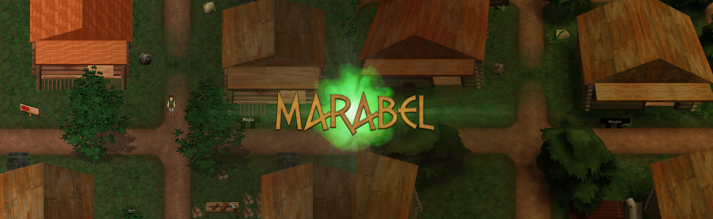

## Marabel

## How to run
1. Install [Nodejs](https://nodejs.org/en/).
2. Install [Typescript](https://www.typescriptlang.org/).
3. Clone this repo and run `yarn install`.
4. Run `yarn server-dev` to start the server.
5. Run `yarn client-dev` to start a client.
6. Should open a window at [localhost:8080](http://localhost:8080/).
7. And Colyseus monitor at http://localhost:8081/colyseus/#/ (read [more](https://docs.colyseus.io/tools/monitor/))

## Roadmap

__Sprint 1: Init__
- [x] (*): Colyseus + Babylon.js boilerplate.
- [x] (*): Movement: client-side prediction + server reconciliation.
- [ ] (client): GUIs: signup, connect, in-game.
- [x] (server): DB player create and connect.

__Sprint 2: World__
- [x] (asset): main city to 3D meshes.
- [x] (asset): floors (layer 1) grhs Atlas.
- [ ] (tool): Legacy World Converter (.maps to .world and .chunks)
- [ ] (client): draw tiles textures by Atlas.
- [ ] (*): chunks load and management. (continuos/treadmill world)
- [ ] (server): Tiled-based movement.
- [ ] (client): client tile triggers (i.e: hide roofs).
- [ ] (server): server tile triggers (i.e: teleport).

__Sprint 3: Multiplayer__
- [ ] (*): click on Tile.
- [ ] (*): click on Entity.
- [ ] (*): range attack.
- [ ] (*): mele attack.

__Backlog:__
- [ ] TBD.
